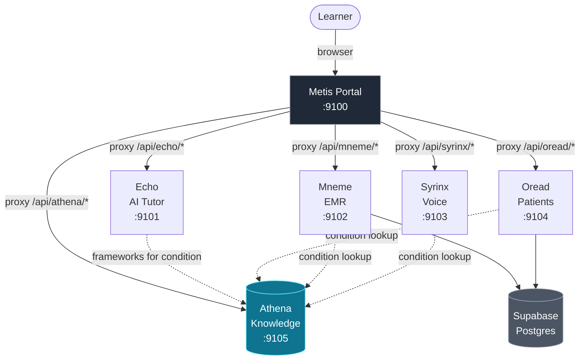
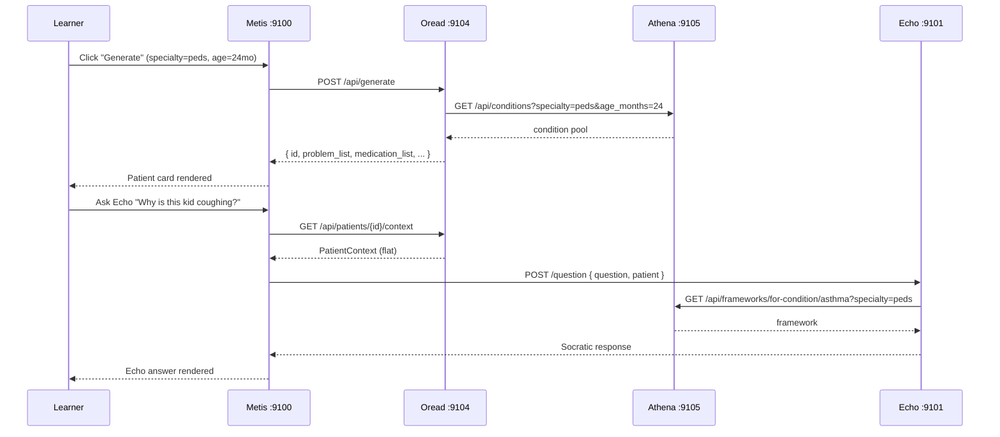
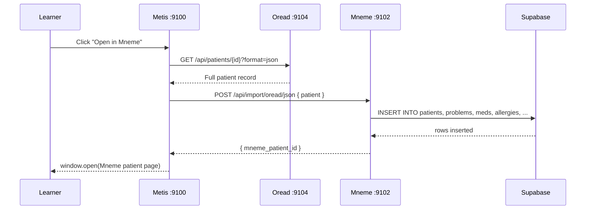
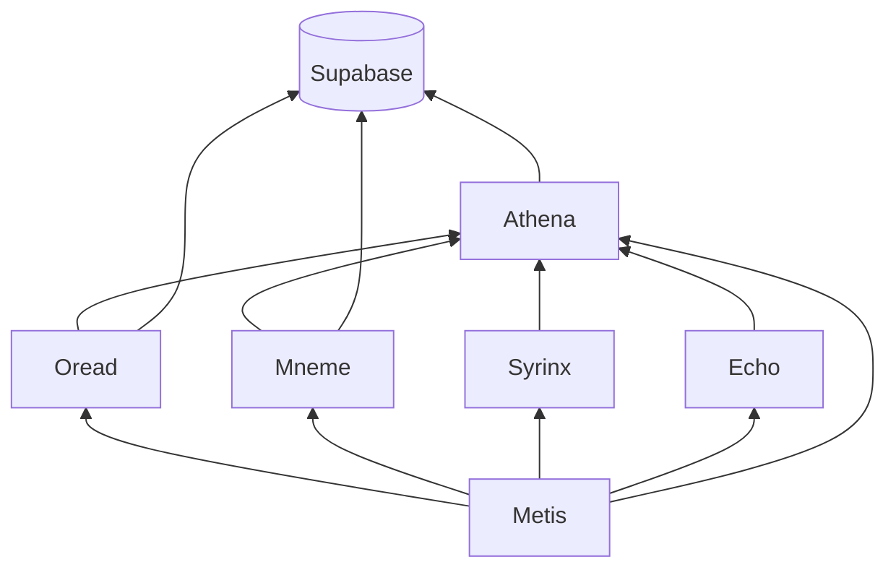
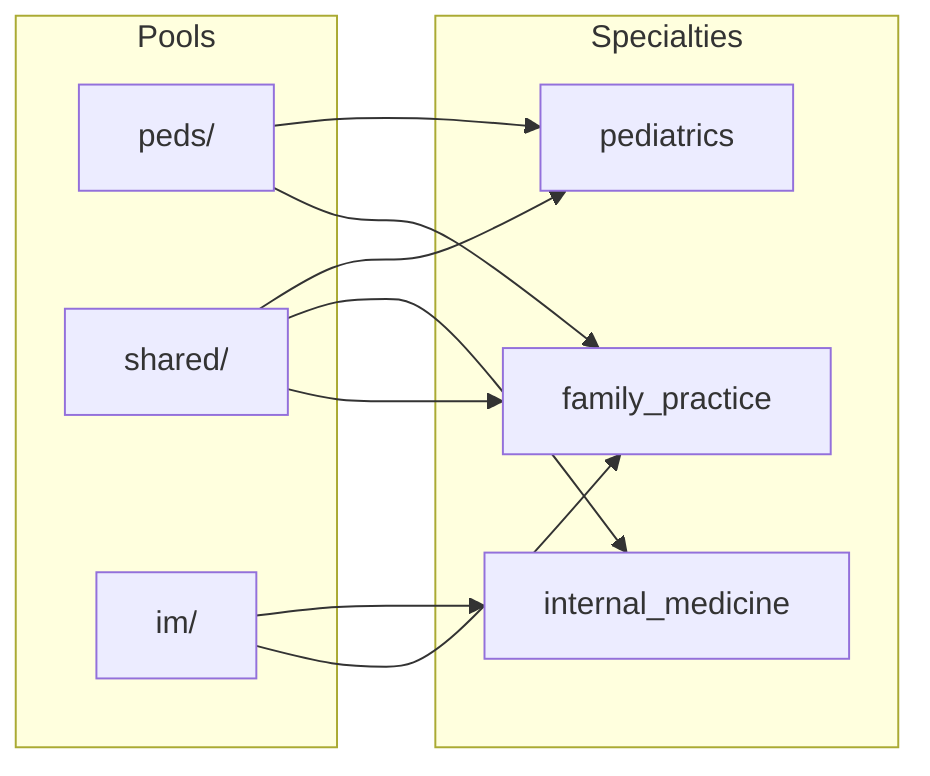
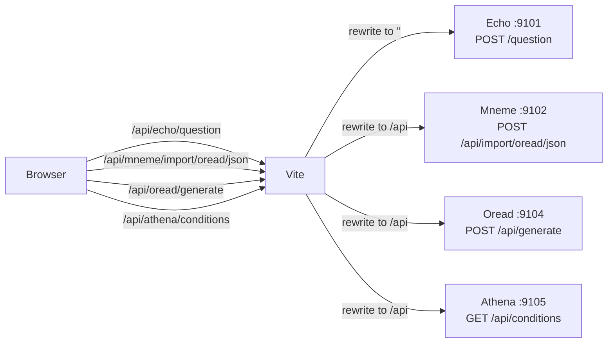
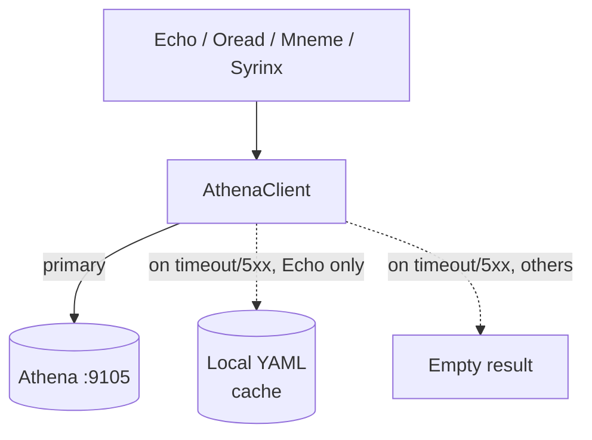
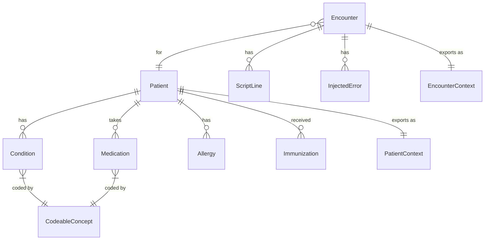

# Architecture

Visual deep-dive on how the MedEd suite fits together. For text-and-table descriptions see [PLATFORM-DESIGN.md](PLATFORM-DESIGN.md). For exact request/response shapes see [INTEGRATION.md](INTEGRATION.md). For per-service overviews see [SERVICES.md](SERVICES.md).

---

## Service topology

- **Solid arrows** = request flow (learner → portal → backends)
- **Dashed arrows** = knowledge queries (backends → Athena) with graceful fallback

---

## Request flow: generate a patient and tutor on it

---

## Send a generated patient to the EMR

---

## Dependency graph

Who depends on whom. Athena is the foundation (depends on nothing); Metis is the apex (depends on everyone).

Reading top-down: Metis sits at the top because it depends on everything. Athena and Supabase are foundational — nothing they need exists higher in the stack.

**Implication for startup order:** `start-all.sh` boots Athena first, then the patient-data services (Oread, Mneme), then the consumers (Echo, Syrinx), then Metis last.

---

## Specialty resolver

How Athena combines knowledge pools per specialty:

FP is not a separate knowledge base — it's the union of peds + IM + shared.

---

## Vite proxy map (dev only)

The dev portal at `:9100` proxies API calls so the browser only sees one origin. All routes have `/api/{service}` prefix from the browser's side:

**Gotcha:** Echo paths get stripped to empty (`''`), not rewritten to `/api`, because Echo's routes don't carry the `/api/` prefix. All others rewrite to `/api`.

In production this proxy becomes a real reverse proxy (Caddy/nginx) — see [DEPLOYMENT.md](DEPLOYMENT.md).

---

## Graceful degradation

Every service that depends on Athena uses an `AthenaClient` with a fallback path:

- **Echo** has a full local YAML mirror — frameworks resolve even if Athena is down
- **Oread / Mneme / Syrinx** return empty knowledge results and continue serving; UI degrades gracefully

This means a single bad Athena deploy doesn't take the whole suite offline.

---

## Data model relationships

Shared models live in `metis/shared/models/` as JSON Schema and are code-generated into each service. See [MODEL-SYNC.md](MODEL-SYNC.md).
